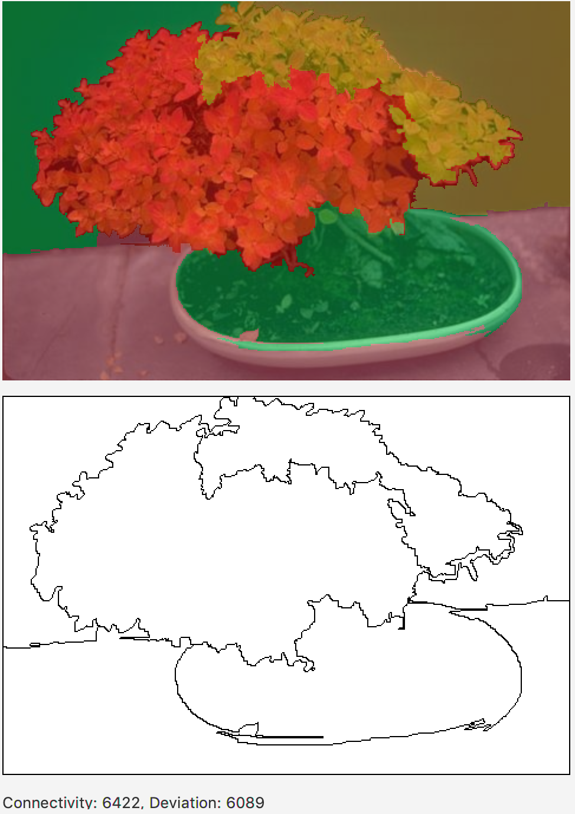
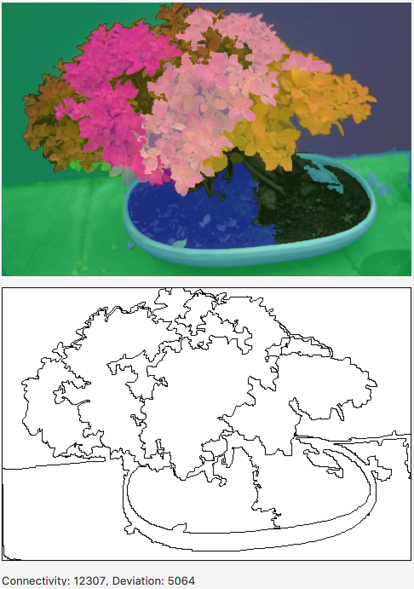
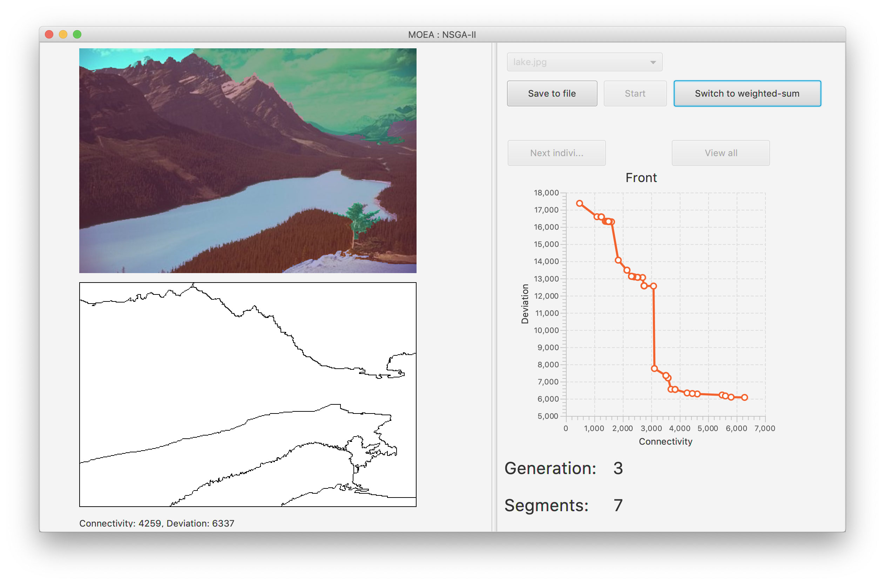

# Image-Segmentation-MOEA
The project uses a Multi-objective optimization (MOO) algorithem called NSGA-II. After running the algorithm on an image, it will return multiple images with segments drawn onto them. See the images below for two different results for the same image.

  
  

The user interface:

  

